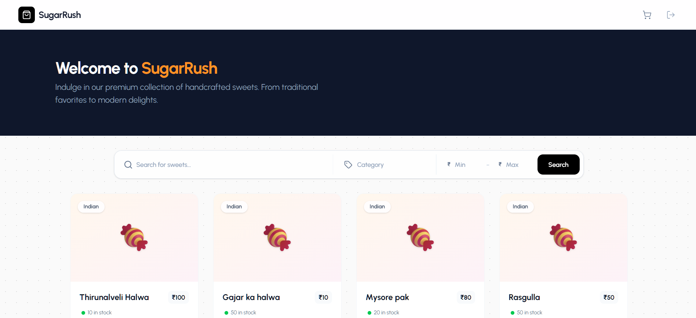
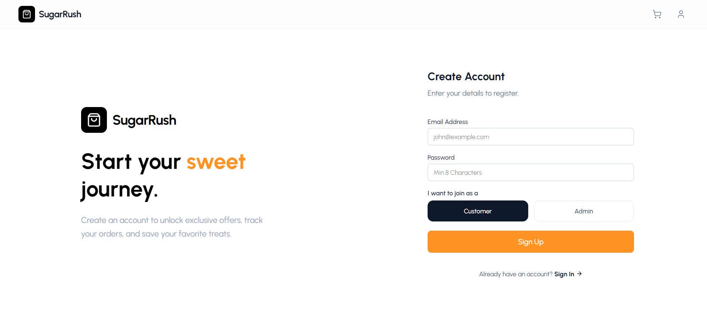
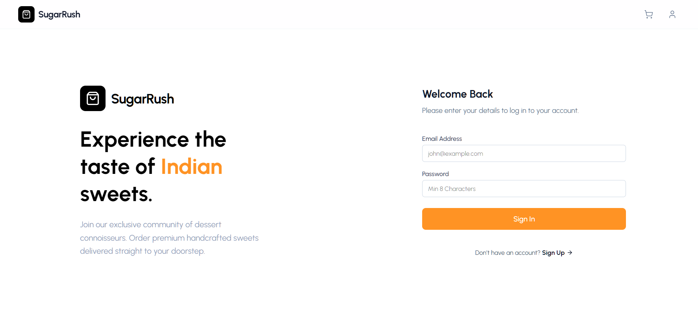
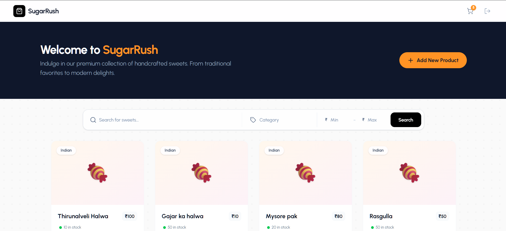
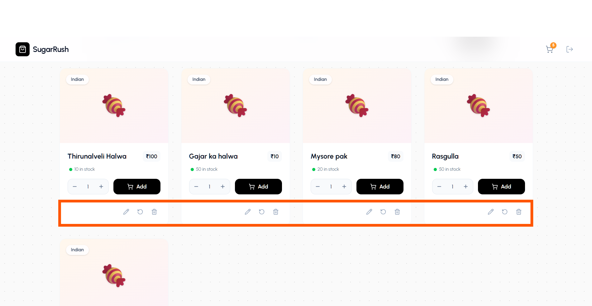
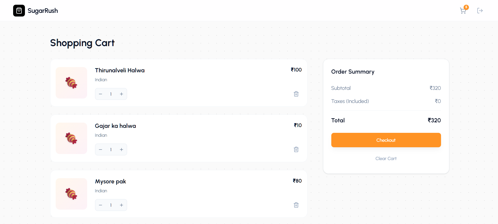

# SugarRush 🍬

Hi! Welcome to **SugarRush**, my personal project where I built a full-stack Sweet Shop Management System. I wanted to create a beautiful and functional application that allows users to browse and order sweets, while also giving admins the power to manage the inventory.

## What I Used (Tech Stack) 🛠️

I built this project using the **MERN** stack because I love how JavaScript works across the entire application.

### Frontend (What you see)
- **React (Vite)**: For a super fast and snappy user interface.
- **Tailwind CSS**: To style everything and make it look premium and modern.
- **Axios**: To handle all the requests to my backend server.
- **Lucide React**: For those nice, clean icons you see everywhere.
- **React Router**: To handle navigation between pages without reloading.

### Backend (The logic)
- **Node.js & Express**: To build the server and handle API requests.
- **MongoDB & Mongoose**: To store all the yummy sweet data and user information.
- **JWT (JSON Web Tokens)**: Key for keeping user sessions secure.
- **Bcryptjs**: To encrypt passwords (safety first!).
- **Jest & Supertest**: For robust testing of all my API endpoints.

### AI Usage in my project: 
- I Implemented Admin form from using Chatgpt and then manually retified it.
- I also implemented Cart feature from GPT fully then fixed the stock count issue.


## My Development Process (TDD) 🧪

I didn't just write code; I built this project using a strict **Test-Driven Development (TDD)** approach.

- **Red-Green-Refactor**: I followed this cycle religiously. I wrote a failing test first ("Red"), wrote just enough code to pass it ("Green"), and then improved the code ("Refactor").
- **TDD Kata**: I treated every feature like a "Kata" – a disciplined practice exercise. This ensured that every piece of logic was verified and reliable before moving on to the next.

This approach helped me catch bugs early and build a bulletproof backend system.

## Where It's Deployed 🚀

I've deployed the project so you can check it out live!

- **Frontend (Vercel)**: [https://sugarrushshop.vercel.app/](https://sugarrushshop.vercel.app/)
- **Backend (Render)**: [https://sugarrush-caam.onrender.com/api](https://sugarrush-caam.onrender.com/api)

## How It Works 🔄

Here is the simple flow of the application:
1.  **The User** lands on the React frontend and browses the sweets.
2.  **The Frontend** talks to the backend API using Axios whenever a user logs in or adds items to their cart.
3.  **The Backend** receives these requests, checks with the database (MongoDB) to get the right data or save new info.
4.  **The Database** sends the info back up the chain, and the user sees the result instantly!

---

## Running It Locally 💻

If you want to run my project on your own machine, here is exactly what you need to do.

### 1. Get the Backend Running

Open your terminal and navigate to the `Backend` folder.

```bash
cd Backend
```

**Install the dependencies:**
```bash
npm install
```

**Set up your environment variables:**
Create a `.env` file in the `Backend` folder. You can copy the format below:

```env
# Database Connection String
MONGO_URI=

# Security Key for Users (Make this long and random)
JWT_SECRET=

# Server Port (Optional, defaults to 3000)
PORT=3000
```

**Start the server:**
```bash
npm run dev
```
You should see a message saying the server is running (usually on port 5000).

### 2. Get the Frontend Running

Open a **new** terminal window and go to the `Frontend` folder.

```bash
cd Frontend
```

**Install the dependencies:**
```bash
npm install
```

**Start the React app:**
```bash
npm run dev
```

That's it! access the link shown in the terminal (usually `http://localhost:5173`) to verify the application.


## Snapshots 📸


*Homepage - Where the sweetness begins*


*Register - Join the community*


*Login - Access your account*


*Admin Dashboard - Manage the shop*


*Admin Edit Sweet - Update inventory*


*Shopping Cart - Your selected treats*

---

Thanks for checking out my work! 🚀
